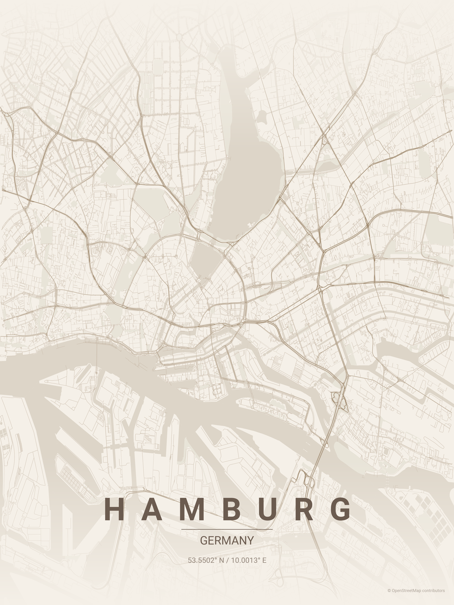
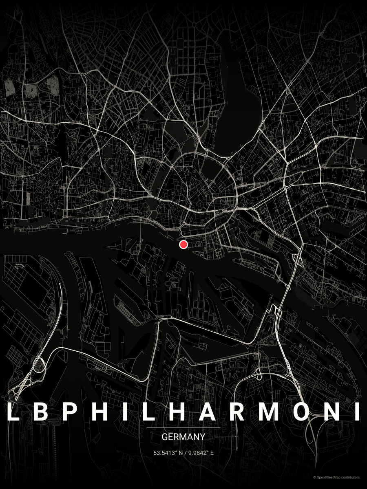

# ⚓️ Premium City Map Poster Generator

Generate breath-taking, gallery-grade minimalist map posters for any city or landmark in the world, complete with dynamic road hierarchies, locator insets, weather integration, and authentic paper texture overlays.

---

## 📐 Layout Formats & Gallery Showcase

The generator supports dual-layout paradigms tailored for high-quality wall framing or museum-style gallery plaque presentations.

### 1. Classic Portrait Format (`--layout portrait`)
Perfect for traditional vertical poster frames. Below are examples of the classic style, including a raw clean print and an authentic textured print:

<p align="center">
  
  &nbsp;&nbsp;&nbsp;&nbsp;
  
</p>

### 2. Gallery Info Plaque Format (`--layout landscape-plaque`)
An elegant 16:10 landscape format with a beautifully rendered data column on the right side. It includes absolute geocoordinates, live forecast or historical weather details (temperature and sky description), custom camera annotations, and precise regional info.

<p align="center">
  
</p>

### 3. Country Locator Inset (`--show-inset` / `-i`)
For a museum-grade cartographic finish, you can display an elegant country locator inset map in any corner (`top-left`, `top-right`, `bottom-left`, `bottom-right`). It renders a minimal, matching outline of the country with a distinctive focal marker pointing exactly to the city's coordinates.

<p align="center">
  
</p>

---

## ✨ Features

- **🗺️ Complete Modular Engine**: Completely rewritten as a structured, clean, and highly maintainable Python package ([maptoposter](file:///Users/ralfo/git/maptoposter_extended/maptoposter/)).
- **🧙‍♂️ Interactive Setup Wizard**: An intelligent CLI wizard that guides you through geocoding, theme selection, size guides, custom layouts, and saves your setup for future automated runs.
- **🎨 20+ Curated Premium Themes**: A gorgeous selection of styles from the historic `warm_beige` and minimalist `noir` to the custom-tailored `waterkant` and `japanese_ink` styles.
- **📐 Dual Aspect Ratio Layouts**: Choose between traditional vertical `portrait` or the informative `landscape-plaque` layout.
- **🗺️ Country Locator Insets**: Add an elegant mini country locator map in any corner (`top-left`, `top-right`, `bottom-left`, `bottom-right`) with a red marker pointing exactly to the city.
- **🌡️ Historical & Forecast Weather Integration**: Fetch and display precise temperature and weather descriptions (from Open-Meteo REST API) for the exact day and time your poster represents.
- **🔴 Focus Markers & Centering**: Highlight landmarks, childhood homes, or special coordinates with a beautifully rendered red marker.
- **📝 Washi Paper Texture Overlay**: Apply an authentic, high-quality Japanese Washi paper texture overlay using advanced blending modes to give your poster a tactile, premium finish.

---

## 🚀 Getting Started

### 1. Installation

Ensure you have your environment set up. Run the automatic installer or do it manually:

```bash
# Clone the repository
git clone https://github.com/ralksta/maptoposter_extended.git
cd maptoposter_extended

# Install dependencies
pip install -r requirements.txt
```

### 2. Start the Interactive Wizard

Simply run the helper script to activate the virtual environment and start the step-by-step wizard (the easiest way to create a poster!):

```bash
./run.sh
```

---

## 💻 CLI Usage

For power users, scripts, and automation, the generator exposes a full suite of CLI options:

```bash
python create_map_poster.py --city <city> --country <country> [options]
```

### Option Reference

| Option | Short | Description | Default / Example |
| :--- | :--- | :--- | :--- |
| `--city` | `-c` | Name of the city | *Required* |
| `--country` | `-C` | Name of the country | *Required* |
| `--theme` | `-t` | Visual theme (21 pre-configured themes available) | `feature_based` |
| `--distance` | `-d` | Map radius in meters (determines zoom level) | `29000` |
| `--focus` | `-f` | Coordinates (`latitude,longitude`) to draw a red focal marker | `53.54129,9.9842` |
| `--center-on-focus` | `-cf` | Center map directly on focus coordinates instead of city center | `Flag` |
| `--show-inset` | `-i` | Enable country locator map inset | `Flag` |
| `--inset-position` | `-ip` | Position of country locator map | `top-left` \| `top-right` \| `bottom-left` \| `bottom-right` |
| `--date` | `-dt` | Date for weather and timestamp | `17.05.2026` or `2026-05-17` |
| `--time` | `-tm` | Time for weather and timestamp | `18:30` |
| `--no-weather` | | Show timestamp but disable fetching weather data | `Flag` |
| `--layout` | `-l` | Poster layout format | `portrait` \| `landscape-plaque` |
| `--no-card-title` | | Explicitly hide the title card directly on the map | `Flag` |
| `--show-card-title` | | Explicitly show the title card directly on the map | `Flag` |
| `--custom-note` | | Custom note / camera specifications for plaque layouts | `Maritime Archive Edition, 50mm Lens` |
| `--paper-texture` | | Apply the authentic Japanese Washi paper texture overlay | `Flag` |
| `--config` | | Path to a pre-defined JSON config file for headless wizard runs | `configs/elbphilharmonie.json` |
| `--select-first` | `-y` | Force using the first match if city name is ambiguous | `Flag` |
| `--list-themes` | | List all available themes with names and descriptions | `Flag` |
| `--wizard` | `-w` | Launch the interactive Setup Wizard | `Flag` |

---

### 🎨 Curated Themes List

Choose from 20+ gorgeous, tailor-made color palettes:

| Theme Name | Description | Style Family |
| :--- | :--- | :--- |
| `feature_based` | Classic black & white with distinct road hierarchy | Minimalist |
| `waterkant` | True maritime Waterkant design, deep sea blue and bright whites | Premium/Maritime |
| `ralf` / `ralf2` | Premium custom layout with delicate pale blue ocean accents | Premium |
| `noir` | Deep minimalist black background with clean white/gray roads | Dark |
| `midnight_blue` | Luxurious navy background with gold-colored roads | Dark |
| `blueprint` | Architectural blueprint aesthetic | Technical |
| `neon_cyberpunk`| High-voltage dark theme with electric pink and cyan | Modern |
| `warm_beige` | Cozy, vintage sepia map tones | Vintage |
| `japanese_ink` | Minimalist organic ink wash style | Vintage |
| `pastel_dream` | Muted, soft dreamy pastels | Pastel |
| `forest` | Deep organic greens and sage tones | Natural |
| `ocean` | Vivid blues and teals for coastal cities | Natural |
| `terracotta` | Mediterranean brick-red warmth | Earthy |
| `sunset` | Vibrant warm oranges and pinks | Warm |
| `autumn` | Seasonal burnt orange and rusty reds | Warm |
| `copper_patina` | Oxidized copper and patina green | Metallic |
| `monochrome_blue`| Monochromatic ocean blue family | Clean |

---

### 🧙‍♂️ Wizard Automation

The interactive wizard allows you to build posters step-by-step and **save your configuration** to `configs/` as a JSON file. 

You can run the wizard in **completely headless, non-interactive mode** by passing the saved configuration:

```bash
python create_map_poster.py --config configs/elbphilharmonie.json
```

**Example Configuration File (`configs/elbphilharmonie.json`):**
```json
{
    "coord_input_mode": "1",            
    "query": "Elbphilharmonie Hamburg", 
    "location_choice": "1",             
    "manual_latitude": "53.5413",       
    "manual_longitude": "9.9842",       
    "focus_choice": "2",                
    "city": "Elbphilharmonie",          
    "country": "Germany",               
    "theme_choice": "noir",             
    "dist_choice": "1",                 
    "custom_distance": "10000",         
    "inset_choice": "1",                
    "inset_position": "1",              
    "weather_time_choice": "1",         
    "date_str": "17.05.2026",           
    "time_str": "18:30",                
    "show_weather_choice": "yes",       
    "layout_choice": "1",               
    "title_choice": "1",                
    "custom_note": "Maritime Edition",   
    "use_paper_texture": "yes",         
    "format": "1",                      
    "font_family": "Montserrat",        
    "width": "12.0",                    
    "height": "18.0",                   
    "confirm_generation": "yes",        
    "save_config_name": "n"             
}
```

---

## 🛠️ Project Structure

```
maptoposter_extended/
├── maptoposter/          # Core package modules
│   ├── __init__.py       # Package initialization
│   ├── cli.py            # CLI entry and arg parsing
│   ├── geocoding.py      # Nominatim & Geopy geographical lookups
│   ├── generator.py      # Matplotlib and PIL rendering engine
│   ├── theme.py          # Theme loader and Font managers
│   ├── weather.py        # Open-Meteo REST API & WMO parser
│   └── wizard.py         # Step-by-step interactive wizard dialog
├── themes/               # Curated JSON theme palettes
├── fonts/                # Custom TTF fonts (e.g. Roboto)
├── posters/              # Generated high-resolution output files
├── assets/               # Static assets (Washi texture overlay)
├── configs/              # User-saved wizard configurations
├── create_map_poster.py  # Thin orchestrator and entrypoint
├── run.sh                # Virtual env setup helper
└── README.md
```

---

## 💻 Hacker's Guide

This guide details internal mechanisms for developers extending the generator.

### Pipeline Architecture

```
                               ┌──────────────────┐
                               │ create_map_poster│
                               └──────────────────┘
                                        │
                                        ▼
                                ┌───────────────┐
                                │   maptoposter │
                                └───────────────┘
                                        │
                  ┌─────────────┬───────┴─────┬─────────────┐
                  ▼             ▼             ▼             ▼
             ┌──────────┐ ┌──────────┐  ┌───────────┐ ┌───────────┐
             │  cli.py  │ │wizard.py │  │theme.py   │ │generator.py│
             └──────────┘ └──────────┘  └───────────┘ └───────────┘
                                                            │
                                                      ┌─────┴─────┐
                                                      ▼           ▼
                                                ┌──────────┐┌───────────┐
                                                │geocoding.││weather.py │
                                                └──────────┘└───────────┘
```

### Z-Order & Rendering Layers

When rendering elements in `create_poster()`, the layer stacking order ensures premium styling without overlaps:

| Z-Order | Elements | Description |
| :--- | :--- | :--- |
| `11` | Text Labels | Spaced City title, country, coordinates, and attributions |
| `10` | Gradient Fades | Top and bottom custom ListedColormap alpha gradients |
| `9` | Focus Point | Red focal marker dot with a crisp white border |
| `3` | Roads | Plotted OSMnx networks colored based on highway hierarchy |
| `2` | Parks | Green spaces and leisure polygons |
| `1` | Water | Canals, rivers, oceans, and natural waterways |
| `0` | Background | Base canvas background color |

### Custom Theme Schema

Themes are simple, declarative JSON files. You can customize focus point sizing and colors inside the JSON:

```json
{
  "name": "Maritime Waterkant",
  "description": "True maritime deep sea blue and bright whites",
  "bg": "#0D1B2A",
  "text": "#E0E1DD",
  "gradient_color": "#0D1B2A",
  "water": "#1B263B",
  "parks": "#415A77",
  "road_motorway": "#FFFFFF",
  "road_primary": "#E0E1DD",
  "road_secondary": "#A5A5A5",
  "road_tertiary": "#7B8C9E",
  "road_residential": "#4F5D75",
  "road_default": "#3D4856",
  "focus_color": "#D62828",
  "focus_size": 400,
  "focus_edge_color": "white",
  "focus_edge_width": 2.5
}
```

---

## ⚖️ License

Distributed under the MIT License. See `LICENSE` for more information.

---

⚓️ *Developed with passion for premium cartographic art.*
